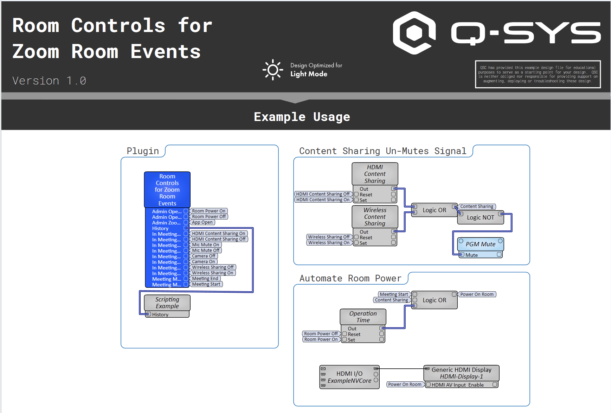

# Room Controls for Zoom Room Events Plugin

This Q-SYS plugin leverages Room Controls for Zoom Room to send one-way event messages locally over TCP from the Zoom Room to Q-SYS. Each event has a corresponding trigger output. This plugin requires external logic to track room state (see provided example file). This plugin automatically creates a JSON profile to be loaded into Zoom Admin portal. This plugin leverages the 'events only' style to allow it to run in the background of a Zoom Room. The plugin hosts its own TCPSocketServer which eliminates the reconnect issues when using ECP for Room Controls. This plugin can work with any Zoom Room system, regardless of compute OS or if the system is utilizing Q-SYS bridging. 

## Version History

 - **Version 1.0**
	 - Initial Release

## Requirements
- Q-SYS Designer Software v9.13 or higher
- Zoom Room Version 6.4.0 or greater
- Room Controls enabled and configuration loaded in Zoom Admin Portal. For more information, visit [this Zoom Help Article](https://support.zoom.com/hc/en/article?id=zm_kb&sysparm_article=KB0064072). 
- Ability for Zoom Room compute to communicate with Q-SYS Core via TCP

# Example File

Included with the repository is an example file that walks through multiple use cases of the plugin.

## Configuration

- Select the appropriate network interface and TCP port.
- Use the `BuildConfig` button to generate the plugin configuration.
- Use `ExportConfig` to save the configuration to the Core or copy directly from the plugin
- Provide the JSON configuration to the client's Zoom administrator to load into Zoom Admin Portal
- Expose the desired pins from the plugin to drive logic in your design. 

## Control Pins

| Name                          | Type      | Direction | Description |
|-------------------------------|-----------|-----------|-------------|
| `Interface`                   | Text      | Input/Output | Network interface selection |
| `Port`                        | Text      | Input/Output | TCP port for socket server |
| `Config`                      | Text      | Output    | JSON configuration preview |
| `Status`                      | Status    | Output    | TCP server status |
| `History`                     | Text      | Output    | Message history log |
| `BuildConfig`                 | Trigger   | Input     | Builds the plugin configuration |
| `ExportConfig`                | Trigger   | Input     | Saves config to Core |
| `ResetTCP`                    | Trigger   | Input     | Resets the TCP socket server |
| `zr_zoom_meeting_started`     | Trigger   | Output    | Fires when a Zoom meeting starts |
| `zr_zoom_meeting_ended`       | Trigger   | Output    | Fires when a Zoom meeting ends |
| `zr_interop_meeting_started`  | Trigger   | Output    | Fires when an interop meeting starts |
| `zr_interop_meeting_ended`    | Trigger   | Output    | Fires when an interop meeting ends |
| `zr_meeting_ring_started`     | Trigger   | Output    | Incoming meeting invite begins |
| `zr_meeting_ring_ended`       | Trigger   | Output    | Incoming meeting invite ends |
| `zr_meeting_item_about_to_start` | Trigger | Output    | Alert for upcoming meeting item |
| `zr_meeting_item_start`       | Trigger   | Output    | Meeting list item starts |
| `zr_meeting_item_stop`        | Trigger   | Output    | Meeting list item stops |
| `zr_phone_ring_started`       | Trigger   | Output    | Incoming phone call begins |
| `zr_phone_ring_ended`         | Trigger   | Output    | Incoming phone call ends |
| `zr_phone_call_started`       | Trigger   | Output    | Phone call starts |
| `zr_phone_call_ended`         | Trigger   | Output    | Phone call ends |
| `zr_video_started`            | Trigger   | Output    | Video turned on (camera unmuted) |
| `zr_video_stopped`            | Trigger   | Output    | Video turned off (camera muted) |
| `zr_video_device_changed`     | Trigger   | Output    | Selected video device changed |
| `zr_microphone_unmuted`       | Trigger   | Output    | Microphone unmuted |
| `zr_microphone_muted`         | Trigger   | Output    | Microphone muted |
| `zr_audio_device_changed`     | Trigger   | Output    | Selected audio device changed |
| `zr_share_started`            | Trigger   | Output    | Wireless sharing started |
| `zr_share_ended`              | Trigger   | Output    | Wireless sharing ended |
| `zr_hdmi_share_started`       | Trigger   | Output    | HDMI sharing started |
| `zr_hdmi_share_ended`         | Trigger   | Output    | HDMI sharing ended |
| `zr_recording_started`        | Trigger   | Output    | Recording started |
| `zr_recording_ended`          | Trigger   | Output    | Recording stopped |
| `zr_elevate_to_meeting`       | Trigger   | Output    | Meeting elevated |
| `zr_user_paired`              | Trigger   | Output    | User paired to Zoom Room |
| `zr_user_unpaired`            | Trigger   | Output    | User unpaired from Zoom Room |
| `zr_digital_signage_started`  | Trigger   | Output    | Digital signage begins |
| `zr_digital_signage_ended`    | Trigger   | Output    | Digital signage dismissed |
| `zr_whiteboard_started`       | Trigger   | Output    | Whiteboarding opened |
| `zr_whiteboard_ended`         | Trigger   | Output    | Whiteboarding closed |
| `zr_companion_whiteboard_connected` | Trigger | Output | Companion whiteboard added |
| `zr_companion_whiteboard_disconnected` | Trigger | Output | Companion whiteboard removed |
| `zr_operation_time_started`   | Trigger   | Output    | Operation time begins |
| `zr_operation_time_ended`     | Trigger   | Output    | Operation time ends |
| `zr_people_detected`          | Trigger   | Output    | People detected |
| `zr_people_not_detected`      | Trigger   | Output    | No people detected |
| `zr_voice_command_on`         | Trigger   | Output    | Voice commands enabled |
| `zr_voice_command_off`        | Trigger   | Output    | Voice commands disabled |
| `zr_zoom_app_opened`          | Trigger   | Output    | Zoom app opened |
| `zr_zoom_app_closed`          | Trigger   | Output    | Zoom app closed |
| `zr_room_controls_opened`     | Trigger   | Output    | Room controls opened |
| `zr_room_controls_closed`     | Trigger   | Output    | Room controls closed |
| `zr_room_startup_completed`   | Trigger   | Output    | Zoom Room startup completed |

